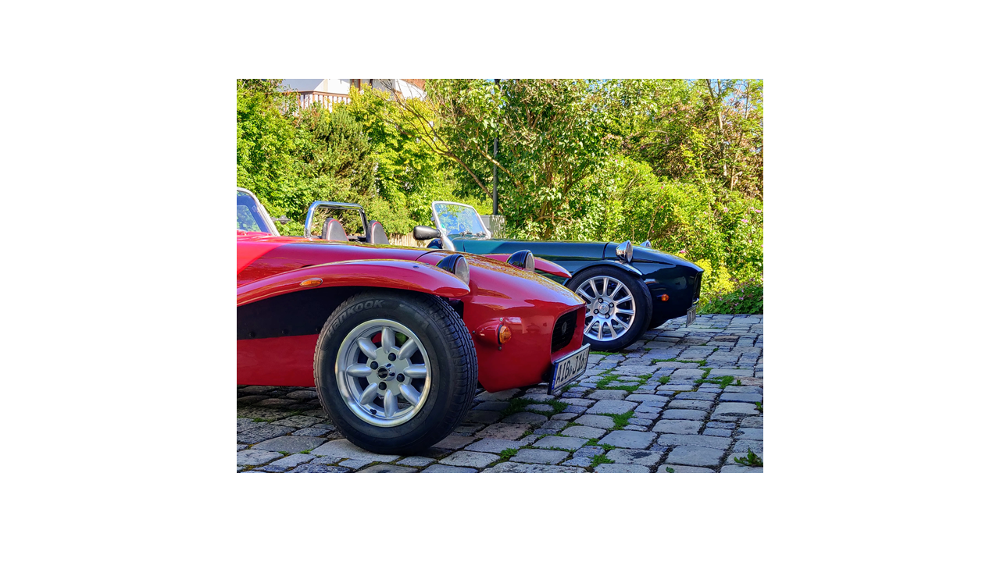

## This is my second content in a different directory

You can use the [editor on GitHub](https://github.com/johsieders/test_blog3/edit/gh-pages/index.md) to maintain and preview the content for your website in Markdown files.

Whenever you commit to this repository, GitHub Pages will run [Jekyll](https://jekyllrb.com/) to rebuild the pages in your site, from the content in your Markdown files.

### Markdown

Markdown is a lightweight and easy-to-use syntax for styling your writing. It includes conventions for

```markdown
Syntax highlighted code block

# Header 1
## Header 2
### Header 3

- Bulleted
- List

1. Numbered
2. List

**Bold** and _Italic_ and `Code` text

[Link](url) and 
```

For more details see [Basic writing and formatting syntax](https://docs.github.com/en/github/writing-on-github/getting-started-with-writing-and-formatting-on-github/basic-writing-and-formatting-syntax).

### Jekyll Themes

Your Pages site will use the layout and styles from the Jekyll theme you have selected in your [repository settings](https://github.com/johsieders/test_blog3/settings/pages). The name of this theme is saved in the Jekyll `_config.yml` configuration file.

### Support or Contact

Having trouble with Pages? Check out our [documentation](https://docs.github.com/categories/github-pages-basics/) or [contact support](https://support.github.com/contact) and we’ll help you sort it out.


Dies ist ein normaler Absatz.

<table>
    <tr>
        <td>Foo0</td>
        <td>Foo1</td>
        <td>Foo2</td>
    </tr>
    <tr>
        <td>Foo3</td>
        <td>Foo4</td>
        <td>Foo5</td>
    </tr>
</table>


Dies ist noch ein normaler Absatz.

| Syntax      | Description |
| ----------- | ----------- |
| Header      | Title       |
| Paragraph   | Text        |


| Syntax      | Description | Test Text     |
| :---        |    :----:   |          ---: |
| Header      | Title       | Here's this   |
| Paragraph   | Text        | And more      |


<h3 id="custom-id">My Great Heading</h3>

I need to highlight these ==very important words== .

H<sub>2</sub>O <br>
H<sup>2</sup>O



<p style="color:red;">This is a red paragraph.</p>

<body>

<h1 style="background-color:powderblue;">This is a heading</h1>
<p style="background-color:tomato;">This is a paragraph.</p>

</body>

<h1 style="font-size:500%;">This is a heading</h1>
<p style="font-size:80%;">This is a paragraph.</p>

<p>Do not forget to buy <mark>milk</mark> today.</p>

<p>My favorite color is <del>blue</del> <ins>red</ins>.</p>

<p>Here is a quote from WWF's website:</p>
<blockquote cite="http://www.worldwildlife.org/who/index.html">
For 50 years, WWF has been protecting the future of nature.
The world's leading conservation organization,
WWF works in 100 countries and is supported by
1.2 million members in the United States and
close to 5 million globally.
</blockquote>

<svg width="100" height="100">
  <circle cx="50" cy="50" r="40" fill="green" />
  Sorry, your browser does not support inline SVG.
</svg>
<br>
<svg width="50" height="30">
  <rect width="50" height="30" style="fill:rgb(0,0,255);stroke-width:0;stroke:rgb(0,0,0)" />
  Sorry, your browser does not support inline SVG.
</svg>

<br>
<svg width="50" height="30">
  <rect width="50" height="30" fill="chartreuse" />
  Sorry, your browser does not support inline SVG.
</svg>

more text