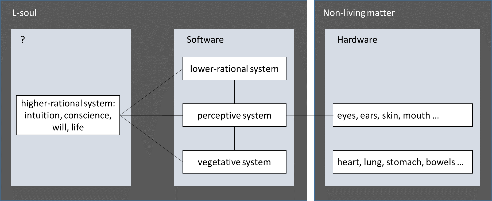
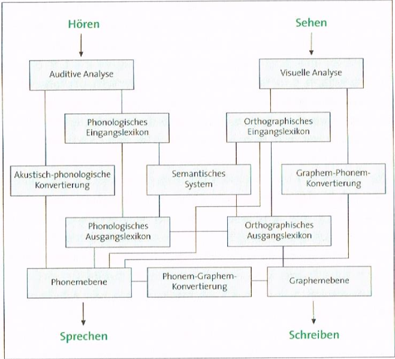

## What Do I Understand by Soul?

*Johannes Siedersleben, Oxford, July 2016*

The importance of the soul is stressed in Matthew 16:26. In the  King James Version (KJV) it reads:

> For what is a man profited, if he shall gain the whole world, and lose his own soul?
> Or what shall a man give in exchange for his soul?

But the Revised Standard Version (RSV), of the National Council of the Churches of Christ in the USA,
reverses the meaning by replacing soul with life:

> For what will it profit a man, if he gains the whole world and forfeits his life?
> Or what shall a man give in return for his life?

The KJV appears to consider the soul eternal, surviving the death of the mortal body.
The soul is a good worthier than any imaginable price. The RSV suggests in contrast that
our limited life is the best we have got, that nothing would compensate its loss and all
is lost at death when life is gone. For me, the two versions refer to two complementing
varieties of the soul, the first explaining death (KJV: D-soul), the other life (RSV: L-soul).
L-souls account for (or are) what living beings own and dead matter lacks:

    dead matter + L-soul = living being

D-souls account for (or are) what remains of a living being after death beyond dead matter.
I find it useful to study them separately , leaving it open if L-souls and D-souls overlap
or even coincide. The L-soul lends itself to a scientific approach because the difference between
living and dead matter can be analysed by proven scientific methods. Some parts of the L-soul
such as blood circulation are well understood, others such as cancer or bad temper much less so.
The existence and nature of D-souls has been subject to disputes for millennia, but no verifiable
evidence has as yet been produced. The study of D-souls is thus confined to psychological research,
theological conjectures and individual faith.

Let us investigate the L-soul first. It accounts for our intangible properties including mood,
temper, intelligence, vice and virtue, conscience, will and our sheer being alive. It does not account for
physical appearance, strength or endurance. The L-soul lives by definition from conception to death and
controls the physical body which must therefore accommodate at least some parts of its L-soul.
According to Plato, Aristotle and others, L-souls are made up of three layers:
the vegetative system present in all living beings including plants, the perceptive system
shared by humans and animals, and the rational system reserved to humans only.
Note that no one has ever seen these layers – it is just a model the Greeks happened to invent and which
has survived to this day. Models can be useful or misleading, ephemeral or long-lived,
but neither true nor false.

I suggest dividing the rational system into two parts: the lower-rational part manages all strictly
rational processes, whatever could theoretically be programmed on a computer, such as tasks of
the diagnosing or decision-making variety, from chess-playing and stockbroking to car driving.
The higher-rational part contains everything else: intuition, conscience, will, life.
Figure 1 shows the non-living body as hardware (on the right) and three layers of software
(in the middle) with the rational system divided into two parts.

*Figure 1: L-soul as a layered system*

As a parenthesis I would like to mention that diagrams drawn by neuroscientists bear a striking
resemblance to those used by software architects: Figure 2 shows a hypothetical design of our
perceptive system.

*Figure 2: Hypothetical design of the perceptive system for listening, watching, speaking and writing*

The higher-rational system is a mystery. Nothing compares to it, no software can as yet produce the
flash of wit leading to a new theory, the will to climb a mountain, the desire for a woman or the enigma of
life, the power to defy the law of entropy. As yet? The theory of computability, a branch of modern logic,
tells us  exactly what is computable and what is not. The separation into lower and higher rational systems
is thus independent of the current state of the art of programming. If intui-tion, conscience, will, and life
were computable the higher-rational system would vanish. My firm guess is that it doesn’t because it is all
but impossible that a theory, which we happened to invent 70 years ago, encompasses all of our thinking,
feeling, being alive.

The suggested division of the rational system is quite different from the well-known opposition of reason and
passion, of the rational and the irrational. The Greeks considered reason the good, the beautiful, in harmony
with nature, while passion equalled evil. Stoicism, which drove this idea to the extreme, amounts to a sedated,
impassible, dismal life with no desires left. Passion was to be suppressed or even extirpated. The suppression
of passion, much encouraged and often enforced later on by the Churches, accounts for deplorable effects such as
Origen’s self-castration, joyless sex for millions, and draconian education methods persisting to this day. But
the tide has turned: today’s engineers and scientists find themselves accused of being too rational and
responsible for our greed of optimisation, inducing unemployment and ecological devastation, while non-scientific
approaches such as alternative medicine are praised by many.

For me this opposition of reason and passion leads nowhere. I find it more useful to have a restricted
lower-rational system, narrowly but unambiguously defined by the programming analogy, and driven by the
higher-rational system, which encompasses whatever will hardly ever be formalized and computable: passion,
desire, preferences, ambitions, love, hatred, frenzy, megalomania and many more features of the mind.
Everyone has got his or her share of these ingredients which yield a healthy mixture for most of us but
an explosive one for some. Life is more intricate than simplistic dualisms such as rational and irrational,
reason and passion, vice and virtue, good and evil feign.

To see how the two of our rational layers collaborate let us look at a chess-player: as he moves his
pieces he is acting exactly like a computer. But earlier in his life he must have taken the higher-rational
decision to learn chess and to gradually excel in this art: by predilection, by following an idol or by whatever
reason. And now, after years of apprenticeship, he is sitting at the chess board, determined to win, perhaps
just for the pleasure of winning, or maybe for his ELO-points, or else be-cause his adversary competes for
the same girl. Thus, his lower-rational, computer-like chess-playing is driven by several higher-rational
processes, which are conscious or unconscious, but at any rate not precisely reasonable in the usual sense.
Adolf Hitler is an extreme example of a man acting perfectly lower-rationally for megalomaniac and genocidal
objectives borne from and fuelled by his insane, explosive higher-rational system. His generals excelled at
conducting war lower-rationally, using exactly the same rules of warfare as the Allies. If, beside James Bond,
there is a single man to be called saviour of the Western world, it is Sir Winston Churchill who, in his speech
after the Dunkirk evacuation on June 4, 1940, took arms against a sea of troubles and by opposing ended them
with the aid of Roosevelt and Stalin. His initiative was foolhardy, against all odds, and not at all reasonable.
But we owe him a lot. Mustn't any human achievement, from a successful chess game to the victory over the
Nazis have been induced and fuelled by much more than sheer rational thinking? How did Shakespeare write his
works? But I am digressing. Let us return to the higher-rational system and ask if and how it could be controlled.

Conscience includes self-observation, self-judgement and self-control, all of this being recursive:
I observe myself observing myself observing myself … . Self-observing software is old hat but the rules
governing it have been defined by the programmer, outside the system. Similarly, Tarski’s
Indefinability Theorem tells us that the concept of truth in a given system is indefinable unless
one uses expressive means that this system doesn’t afford. Truth (at least in the sense used by logicians)
requires a higher system it relies on, leading to a stack of infinitely many systems. The higher-rational
system is the top layer of the human system. Does it control itself or is it subject to any higher sway?
And if there is one, where is the top layer, if any? If I knew it, I would tell you.

The middle (software) part of Figure 1 gives hints to the nature of the L-soul: much of it is information,
stored in our body like on a hard disk: genetic information resides in the DNA, knowledge in the brain.
Information evolves over time: it accumulates, gets modified or lost. Information can be copied, ciphered,
deciphered, modified and stored elsewhere – on a hard disk or perhaps even in one or more different bodies.
Information can be stored forever while being subject to obsolescence or irrelevance – a strange and
deceiving kind of immortality, but indicating at least how parts of the L-soul might make their way
into the D-soul to which we now turn.

I have defined the D-soul as whatever remains after death beyond the corpse, neglecting the question
when the D-soul comes into existence and when if ever it ceases to exist. I also leave it open if and
how a D-soul materialises: as an unfathomable ghost, a physical body to be carried by Charon across the
rivers Styx and Acheron, a combination of both or whatever else. Witness reports of near-death experiences
are rare, heterogeneous and unconvincing. Death is an undiscovered country from whose bourne no traveller
returns. I know no empirical, let alone logical argument suggesting the existence of a D-soul, bearing
in mind that absence of evidence is no evidence of absence.

Assuming the existence of D-souls against many odds, some puzzling questions arise:
What is the lifetime of a D-soul? Does it begin at conception or before? Is there a
universal store of all D-souls that will ever live, i.e. will ever be associated with a
physical body? Are D-souls recycled from one body to another? What is a D-soul made of?
Does it have a weight? Is a D-soul just one indivisible entity or can it be thought of as a set of
components interacting with each other? Can a D-soul exist on its own, independent of any associated body?
Can two bodies share one instance of a D-soul or can one body have two different D-souls? Much mental
energy has been invested in these questions, but I cannot recognise any convincing answers.
I see however at least four interesting arguments explaining the attraction and divulgence of
the idea of D-souls remaining after death.

1.	*Man-centricity:* Our ancestors considered the earth the centre of the world and mankind the apogee of creation.
In their view it is unthinkable that men just vanish at death – they cannot but survive in some higher form of existence.
But today many believe that the Earth is just a grain of dust in the universe and mankind a spark in eternity.
Life is just a poor player that struts and frets his hour upon the stage and then is heard no more.

2.	*Balance of justice:* In our world many criminals go unpunished while many saints suffer.
Assuming a universal balance of justice there must be other worlds (heaven, hell or whatever)
compensating our world’s blatant imbalance. But there is little evidence for that compensation.
Some argue that a perfect God has created a perfect universe and that anything short of a universal
balance of justice wouldn’t be perfect. This reminds me of the argument that planets cannot travel
anywhere but on perfect spheres, precluding ellipses.

3.	*Fear of death:* a Darwinian argument explains why most of us fear death:
those who do tend to escape it longer than those who don’t. So, all those sharing
that fear need an expedient to face the lurking death, and this is where the idea
of surviving death and hopefully entering heaven as a D-soul comes in handy.

4.	*Solace:* Many consider this world a valley of misery we must go through before we are allowed
to enter heaven. In their view death is welcome because it delivers us from our useless, sinful
body and opens the door to eternal happiness, assuming some prerequisites are fulfilled (e.g. being elected,
having accumulated a sufficient amount of good deeds). This point, which strangely contradicts the preceding
one, has probably been the most important in history: the larger part of mankind lives to this day in appalling
conditions of misery and/or suppression. The expectation of a better world awaiting at least the just among
us has been for many the only way to bear the unbearable. Karl Marx called it opium for the people.

The L-soul does exist by definition. We will never understand it completely, given our inability to
tackle trivial problems like bad temper. But the L-soul is something to work on, something we have
methods and tools to start with, to progress year by year, century by century. The D-soul is a different
kettle of fish. It leads directly to the nagging question: Will I (that is: my D-soul) or will I not get a
place in paradise? The dispute about how to get a ticket has done untold harm to mankind to this day.
