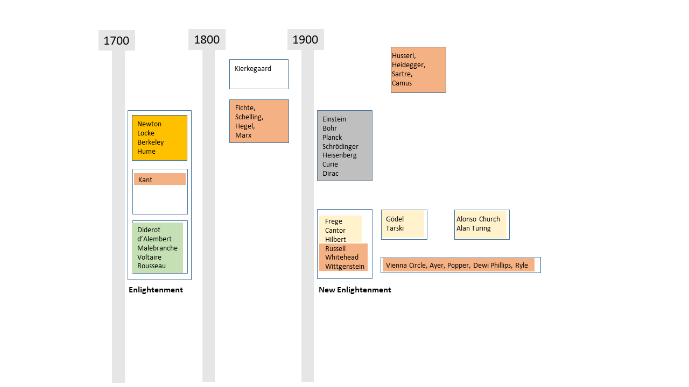

# Philosophy on Two Charts

*Johannes Siedersleben, Oxford, July 2016*

The following is based on my notes of a course on “Philosophy of the Soul” in 
Oxford from 17 to 22 July 2016.

## Introductory Remarks

1. The question is: what will I remember in one year ot later? 
There is no way to remember a hundred names and as many ideas. 
The two charts below represent a structure which I can memorize. It is along
these boxes that I can think “Ok, that was this guy in the top left corner”, 
and I have a point to start from. This one might or might not find helpful.

2. There is only a vague semantic governing boxes and layout. 
Each box contains a couple of names sharing a period, a region, or a subject. 
Other authors would have drawn other boxes and arrows. 
There is obviously a timeline from left to right, but it is deliberately not too accurate. 
There is a commented colour code showing some links between the boxes (but far from all).

3. There is no uniform progress. One can observe four boosts:
   1. 500 – 300 BC simultaneously in Greece, China and India. 
   2. Renaissance from 1453 till 1600 facilitated by many events: fall of Constantinople 
   and scholars fleeing Turkey and arriving in Europe with their books; the printing machine, 
   the discovery of America. It was then fuelled by the Reformation and new ideas such as 
   the ones of Copernicus. If there is one German sentence worth knowing then it is this one:
   “Oh Jahrhundert, oh Wissenschaft, es ist eine Lust zu leben” 
   (Oh century, oh science, it is a joy to live.) 
   It was Ulrich von Säckingen, a companion of Luther, who said this. 
   3. Enlightenment from about 1700 to 1800: The key phrase is that of Kant: 
   Sapere aude (“dare to know” or “dare to be wise”). A feeling of departure must have been prevailing,
   illustrated by the key phrase: “Let’s calculate” (I think this was Spinoza): 
   The idea was that all questions such as the one if there is a soul would eventually boil down to
   irrefutable calculations with no uncertainty left. This turned out to be way too optimistic. 
   4. New Enlightenment from 1880 till 1940: This was really the start into our age.
   

4. There are two periods with little progress:
   1. The Romans were busy conquering the Western world but not too inventive otherwise, as far as I can see.
   2. The Middle Ages from about 450 (fire in the Alexandrian Library, murder of Hypathia, 
   the first female scientist) till the Renaissance beginning in 1453. The few notable
   contributions of this time include Aquinas’ Scholasticism, a very debatable set of ideas. 
   It is called by many the Dark Age, a name contested by others pointing to Hildegard von Bingen.
   In the Dark Age progress did take place in the Arabic world where Arabic numerals were invented.

   
5. These charts show some philosophy, a little science and even less history of religion. 
I can think of many other charts of that kind, each showing different aspects of history: politics,
religion, arts, political systems from tyranny to democracy, warfare from daggers to atomic bombs, 
logic and mathematics and so on. Bill Bryson’s marvellous book “At Home” describes
another thread: how our civilisation has evolved, including the digging of canals and the use of toilet paper. 
Should I ever have the time to draw other charts, I’ll let you know.

## Chart One: From 500 BCE to 1700 CE

### Colour Code

<svg width="40" height="15">
  <rect width="50" height="15" fill="yellowgreen" />
  Sorry, your browser does not support inline SVG.
</svg>
Greek geometry: Euclid is outstanding; his book was used as a textbook until recently and notably by Pascal. 
Euclid summarizes all of Greek mathematics, including Thales and Pythagoras. It contains virtually no mistakes. 
This is how mathematics works to this day: axiom, premise, proposition, proof. 
This pattern would be adopted later on by Spinoza, who set out to mathematise philosophy, in vain, one must say.

   
<svg width="40" height="15">
  <rect width="50" height="15" fill="skyblue" />
  Sorry, your browser does not support inline SVG.
</svg>
Stoicism, founded by Zeno: “Do not ask things to happen as you want, 
but wish that things happen as they do and you will be happy.“ 
This bizarre philosophy was taken up by the Roman Stoics: Seneca, Epictetus, Marc Aurel.

   
<svg width="40" height="15">
  <rect width="50" height="15" fill="lightsalmon" />
  Sorry, your browser does not support inline SVG.
</svg>
Epicure was the founder of Epicurism (unsurprisingly), a philosophy much more friendly than Stoicism. 
Epicure carried further the work of Democritus who had invented a theory of atoms out of the blue. 
Epicure is known only through Lucretius, whose work De Rerum Natura was banned; 
only one copy survived the Middle Age. Nice book: “The Swerve” by Stephen Greenblatt.

   
<svg width="40" height="15">
  <rect width="50" height="15" fill="lightgrey" />
  Sorry, your browser does not support inline SVG.
</svg>
This is the Socrates/Plato/Aristotle story. Note that Aristotle’s physics was wrong, and his logic incomplete and faulty. 
His influence however was huge: Aquinas’s foundation of Christian faith was based on Aristotle, 
and so was Kant’s Critique of Pure Reason. Note that logic was completely reinvented later on by Frege, Russell and others. 
It was not before the end of the 20th century that the Catholic Church allowed amendments or alterations of Aristotelian Logic. 
Plotinus is mentioned as the most important Neo-Platonian.

   
<svg width="40" height="15">
  <rect width="50" height="15" fill="gold" />
  Sorry, your browser does not support inline SVG.
</svg>
The earth is not the centre of the world. Copernicus was the first to formulate this thesis, 
Kepler proved it based on Brahe’s records, Galileo refined it and Newton set a temporal
endpoint with his gravitation theory.

   
<svg width="40" height="15">
  <rect width="50" height="15" fill="peru" />
  Sorry, your browser does not support inline SVG.
</svg>
Christianity took a long time to be what it should remain until the Reformation. 
The Church fathers contributed a lot to this convergence. St. Jerome is the creator of the Vulgate,
the official Bible of the Catholic Church to this day. 
Luther, a completely unknown monk, brought about what can be called the most important revolution of all time. 
His marvellous translation of the Bible was the first to be distributed on a large scale and it forged the 
German language very much like Shakespeare did the English one.

   
<svg width="40" height="15">
  <rect width="50" height="15" fill="lightcyan" />
  Sorry, your browser does not support inline SVG.
</svg> 
Plato wrote the <em>Republic</em>, More <em>Utopia</em> and Hobbes <em>Leviathan</em>, 
three visions of future societies no one would like to live in.

## Chart Two: From 1700 CE to 1950 CE

### Colour Code

<svg width="40" height="15">
  <rect width="50" height="15" fill="gold" />
  Sorry, your browser does not support inline SVG.
</svg>
The English Enlightenment was born from Newton’s results and facilitated 
by the Glorious Revolution in 1688. Hume is an extreme Sceptic: there is only perception, no reality.
The laws of nature are just repeated observations, how do you know if the sun will be rising tomorrow morning?

   
<svg width="40" height="15">
  <rect width="50" height="15" fill="lightsalmon" />
  Sorry, your browser does not support inline SVG.
</svg>
Kant was shocked by Hume’s convincing but devastating reasoning. 
Kant’s answer was the Critique of the pure an of the practical reason, inspired by 
“the starry heaven above me and the moral law within me”, 
the former standing for pure reason, for what we can truly know, 
and the latter for practical reason, such as the categorical imperative. 
Kant had two branches of successors: the Continental line, starting with the German Idealist, 
including Fichte, who is considered one of the fathers of German Nationalism, Marx who
put Hegel upside down and leading finally to the French existentialists. 
The other branch is more British with Russell, Whitehead and Wittgenstein, Austrian, but pupil of
Russell. This line leads later on to the Logical Positivists, 
heavily blamed e.g. by Popper for their verification principle.

   
<svg width="40" height="15">
  <rect width="50" height="15" fill="yellowgreen" />
  Sorry, your browser does not support inline SVG.
</svg>
The French Enlightenment: Encyclopaedists and polymaths d’Alembert and Diderot, 
Rousseau requesting Human Rights, and Voltaire, the first intellectual. Voltaire and Rousseau
didn’t like each other. It is probably on purpose that they are resting 
one opposite the other in the Pantheon in Paris.

   
<svg width="40" height="15">
  <rect width="50" height="15" fill="grey" />
  Sorry, your browser does not support inline SVG.
</svg>
This is European physics around 1900: an incredible boost of inventions 
that have changed the world: relativity, quantum mechanics, radioactivity, and many more.

   
<svg width="40" height="15">
  <rect width="50" height="15" fill="lemonchiffon" />
  Sorry, your browser does not support inline SVG.
</svg>
This is logic and mathematics, widely unknown by the public, but of tremendous importance 
and the basis of all computer science. Frege, Russell and others were the first to
come up with a sound logic. Today’s logic is to that of Aristotle what an A380 is to Lilienthal’s plane. 
Based on the new logic they completely reinvented mathematics: 
today mathematicians have a clear understanding of infinity and the continuum. 
Hilbert was the leading mathematician of this time around 1900, he orchestrated much of the ongoing
research. Much to the regret of the researchers involved, the main results are theorems stating an 
incompleteness or an impossibility: in any system there are statements which
cannot be proven or disproven, it is impossible to define truth within a system 
(hence there is no absolute truth), and however you define computability, there will always be
loads of problems which are demonstrably incalculable or whose calculability cannot be proven, 
which is just as bad. Our thinking is thus confined into narrow limits we will
never escape however hard we try. Church and Turing found independently and simultaneously 
the basics of modern computer science: two abstract computing models
describing the innermost principles of computing, valid to this day. 
The real computers came five years later.